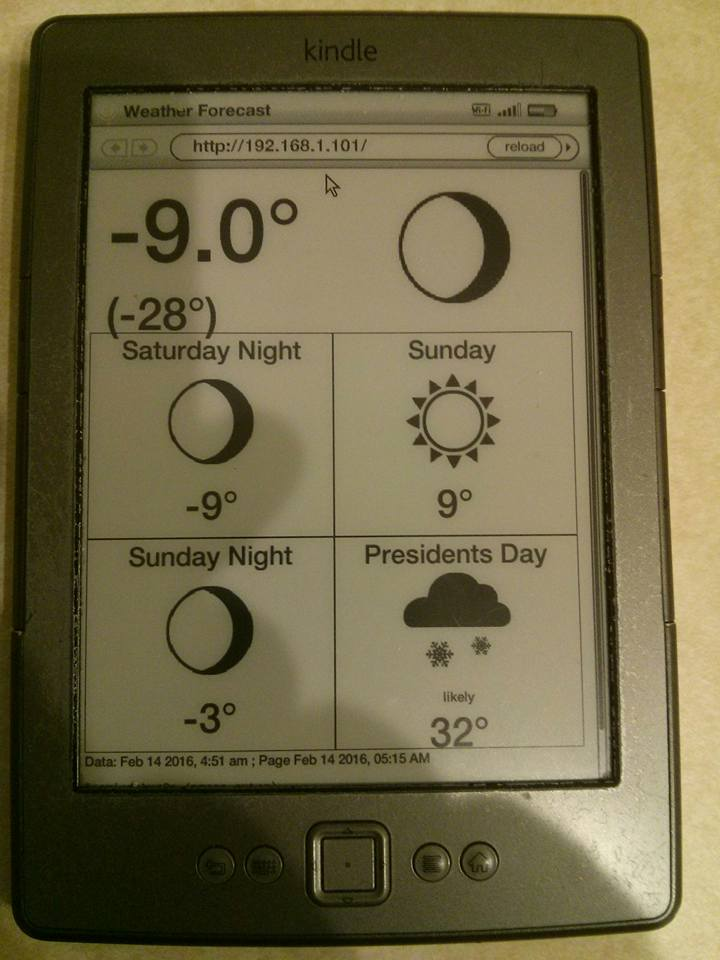

# Kindle weather page

## This project consists of three distinct sub-projects:
1) The Tablet Weather page, shown above. This is a standalone project.
2) A python script with reads air-quality information on a Raspberry Pi and
  - updates a static web page served by a webserver running on that pi;
  - writes the data to a cloud-based REST servive for storage (see the next item)
  This script can read temperature, humidity, and air pressure from a Raspberry Pi SenseHat; temperature from a 1-Wire temperature sensor (based on the DS18B20 sensor chip), and air quality levels (at 2.5 micron and 10 micron particulate matter sizes) 
3) That script writes to a RESTful web service based on Express and node.js which provides an interface to a database that stores the air quality data.

